# Midterm Documentation

## Phase 1

I want to create a rotated triangle pattern. I made a 25 by 25 grid and added a square, drew a circle inside the square, then a triangle inside the circle starting at (x,y) = (4,4). 

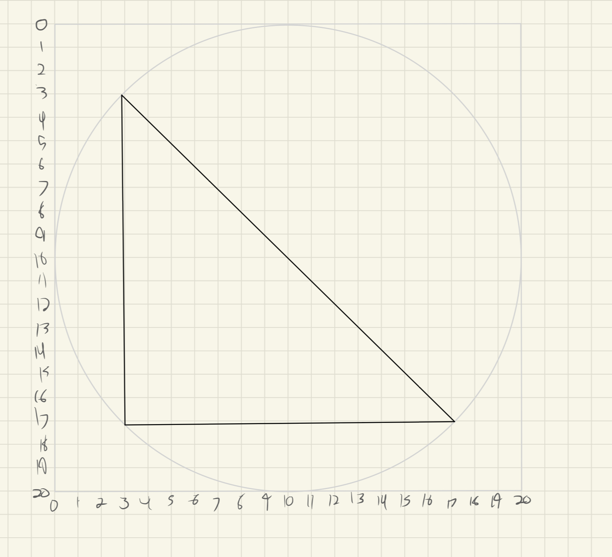

Then I rotated it a bunch of times. I got lazy and stopped. Once I figure out the code, I'll let the computer finish it for me. Hopefully you get the basic idea though.

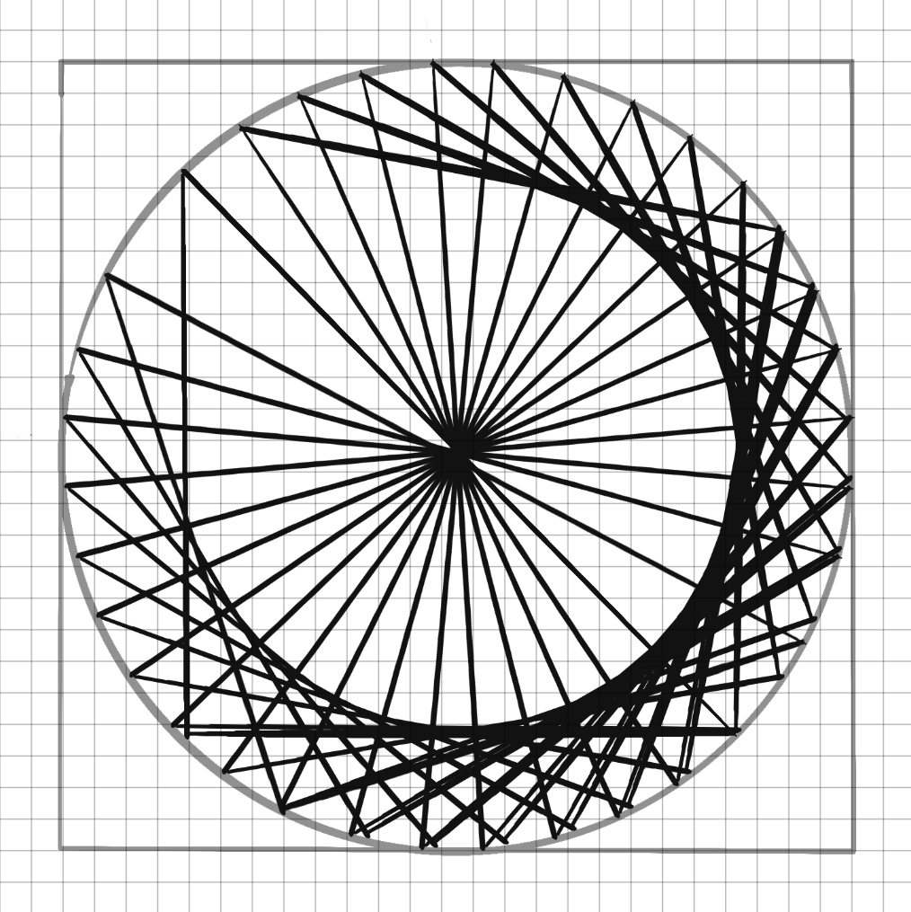

## Phase 2

I started by giving each square on the grid 10 pixels. I didn't want any shape to have a fill, and I did want a stroke.

```
def setup():
    size(250, 250)
    noFill()
```

Then I made the first triangle.

```
def drawUnit():
    triangle(40, 40, 40, 210, 210, 210)
```
    
Then I tried to make it draw all the triangles. This did not work. I tried moving ```angle == 0``` to below the def, but it still didn't work.

```
def draw():
    for i in range (12):
        angle == 0
        rotate(radians(angle))
        drawUnit()
        angle += 10
```

I tried cutting the code down into this, and nothing was drawn. There's probably something wrong with the rotate function. I tried it with a rectangle just in case. Yes, the rotate function is not working.
```
def setup():
    size(250, 250)
    noFill()
def draw():
    rotate(PI/3.0)
    triangle(40, 40, 40, 210, 210, 210)
```

I learned about the transformation matrix. The rotation function just shifts the angle of where shapes are drawn to, so it shifts around (0,0). What I can do is move the origin using the translate function so that the rotation function will work better. The following changes the origin to the center of the canvas. The triangle looks the same as before but now it's entered differently. I also changed the canvas to 200x200 because it felt easier to me.

```
def setup():
    size(200, 200)
    noFill()
def draw():
    translate(100, 100)
    triangle(-70, -70, -70, 70, 70, 70)
```
I added rotation to test if it would work, and it did:

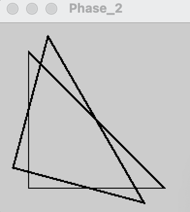

Now I can try some of what I made before to see if it works.
```
def setup():
    size(200, 200)
    noFill()
def drawUnit():
    triangle(-70, -70, -70, 70, 70, 70)
def draw():
    translate(100, 100)
    for i in range(24):
        rotate(PI/12)
        drawUnit()
```
It worked.

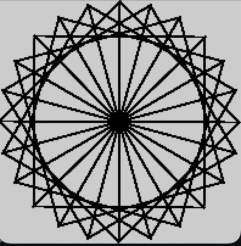

I just realized I can do a lot by changing the drawUnit to make some interesting rotation art!
```
def drawUnit():
    pushMatrix()
    triangle(-70, -70, -70, 70, 70, 70)
    quad(-30, -30, 0, -100, 60, 0, 20, -70)
    rect(0, 0, 17, 23)
```

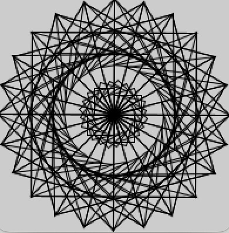

I checked what would happen without pushMatrix(). The lines become blurrier for some reason, so I'll keep it for now.

## Phase 3
I referenced the example for Phase 3 in the README [here on Github](https://github.com/rdwrome/261sp24/tree/main/07Midterm). Using the organization of the code, I kept the drawUnit function and made a new drawObject function with parameters x, y, and s. Following the example code, I pushed the matrix, set the translation, then the scale, then drew the shapes, then reset the matrix. The only issue I had was that I wanted to not let the shape go over the border, so I added a base translation of `100 * s` for x and y (because at a scale of 1, the origin needs to be at (100,100) to draw the shape without going over the border).

I added descriptions for each line for easy interpretation.

```python
def setup():
    size(800, 800) # sets canvas size
    noFill() # disables drawing fill
    
def drawUnit():
    triangle(-70, -70, -70, 70, 70, 70) # draws a triangle
    #quad(-30, -30, 0, -100, 60, 0, 20, -70) # draws a 4 sided shape
    #rect(0, 0, 17, 23) # draws a square
    #they are turned off because they make the shape too busy when small scaled.
    
def drawObject(x, y, s): # draws the object at a specified coordinate and scale.
    push() # saves the current drawing position
    translate(x + 100 * s, y + 100 * s) # translates the origin.
    scale(s) # scale around origin.
    for i in range(24): # draws a unit, rotates around the origin, and repeats.
        drawUnit()
        rotate(PI/12)
    pop() # returns the saved drawing position.
    
def draw():
   drawObject(0,0,2)
   drawObject(400,0,2)
```
This is what the code currently draws:

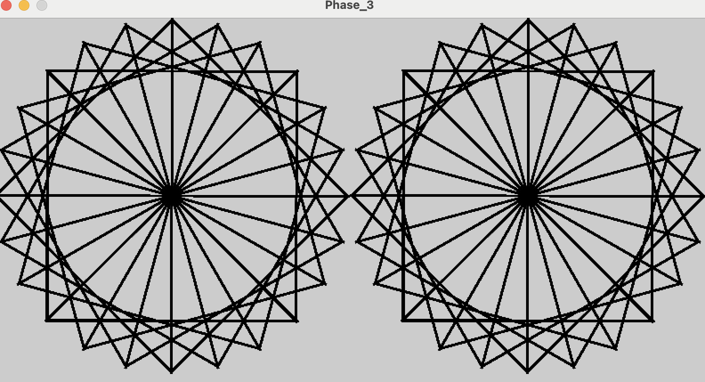

## Phase 4

Pseudocode:
800x800px
1x1 grid = 800x800
5x5 grid = 160x160 cell size
10x10 grid = 80x80 cell size
Cell dimensions: (width/grid, height/grid)

With 800x800:
Scale is 4 for 1x1
Scale is 2 for 2x2
Scale is 1 for 4x4

With 400x400:
Scale is 2 for 1x1
Scale is 1 for 2x2

With 200x200
Scale 1 is 1x1

I want the scale to depend on the canvas size, but I don't want the canvas size to depend on the scale. I'll make a new variable called gridSize.

I made gridsize, and since I want 1 to mean 1x1 and all other scale values to be between 0 and 1, I also made scaleValue equal 1 over gridSize. However, when I put a fraction into the scale function under draw Object, it doesn't work. I thought it might have to be a float, so I tried making scaleValue equal `float(1 / gridSize)` but it still didn't work. The canvas is just blank.

```python
gridSize = 2 # type 1 for 1x1 tiling, 2 for 2x2, etc.
scaleValue = 1/gridSize

def setup():
    size(800,800) # sets canvas size
    noFill() # disables drawing fill

def drawUnit():
    triangle(-70, -70, -70, 70, 70, 70) # draws a triangle
    #quad(-30, -30, 0, -100, 60, 0, 20, -70) # draws a 4 sided shape
    #rect(0, 0, 17, 23) # draws a square
    #they are turned off because they make the shape too busy when small scaled.
    
def drawObject(x, y): # draws the object at a specified coordinate and scale.
    push() # saves the current drawing position
    translate(x + 100 * scaleValue * width / 200, y + 100 * scaleValue * width / 200) # translates the origin.
    scale(scaleValue * width / 200) # scale around origin.
    for i in range(24): # draws a unit, rotates around the origin, and repeats.
        drawUnit()
        rotate(PI/12)
    pop() # returns the saved drawing position.
    
def draw():
   #for i in range(width):
       #for j in range(height):
    drawObject(0, 0)
```

It works when scaleValue is not assigned a value using arithmetic. Maybe there's an issue with the number of decimals when doing arithmetic?

I figured out that it doesn't like dividing by a variable but doesn't mind multiplying. Not what I need though.
```python
g = 4
v = float(1/g)
print('V equals', v)
#It prints 0.0
```
I just had to change g to a float before diving by it. This works.
```python
g = 4
v = 1 / float(g)
print('V equals', v)
```

Now that this works, I need to make it tile. I made a new variable called cellSize which takes the canvas size and divides by the grid size to get the number of pixels per grid section. In the `draw()` function, I first set up a for loop for width, with a nested for loop for height. Then I thought to put an if before running the height for loop. It checks for if the index, which would be equal to the x coordinate, is divisible by the cellSize. That way it only runs the height loop if it is on a space where an object should be printed. Then, it runs the height for loop. It checks if the index is divisible by the cell size again, and prints the object if it is. I tried it and it worked the first time! 

```python
canvasSize = 800
gridSize = 20
scaleValue = 1 / float(gridSize)
cellSize = canvasSize/ float(gridSize)
      
      
def setup():
    size(canvasSize, canvasSize) # sets canvas size
    noFill() # disables drawing fill

def drawUnit():
    triangle(-70, -70, -70, 70, 70, 70) # draws a triangle
    #quad(-30, -30, 0, -100, 60, 0, 20, -70) # draws a 4 sided shape
    #rect(0, 0, 17, 23) # draws a square
    #they are turned off because they make the shape too busy when small scaled.
    
def drawObject(x, y): # draws the object at a specified coordinate and scale.
    push() # saves the current drawing position
    translate(x + (100 * scaleValue * width / 200), y + (100 * scaleValue * width / 200)) # translates the origin.
    scale(scaleValue * width / 200) # scale around origin.
    for i in range(24): # draws a unit, rotates around the origin, and repeats.
        drawUnit()
        rotate(PI/12)
    pop() # returns the saved drawing position.
    
def draw():
    for i in range(0,width):
        if i % cellSize == 0:
            for j in range(height):
                if j % cellSize == 0:
                    drawObject(i,j)
```


After this I added some features. I added a variable `rotations` to define how many rotations of the shapes should happen for each object. I added `noLoop()` and `redraw()` on mouse click so that it only redraws when the mouse is clicked. This can be toggled by turning it into a comment with a hashtag. I also added some colorization features (greyscale). One colorizes it to a static sine wave to make an ombre effect. I altered the code I found on [this](https://github.com/rdwrome/261sp24/blob/main/06Lists/Processing/3.sinewave/sinewave.pyde) Github page to make it work. The other is random. The different options can be toggled by adding or removing a hashtag in front of them. 

```python
from random import random as r

# how many pixels wide and tall should the square canvas be? Please enter a multiple of 100.
canvasSize = 400

# how many rows and columns will there be? 4 means a 4x4 grid.
gridSize = 10

# 1 means each object just touches. Set to between 0 and 1 to increase 
# the space between each object. Set above 1 to overlap objects.
scaleValue = 1 / float(gridSize)

rotations = 24 # how many rotations before reaching 2PI radians.

# calculates the pixel width/height of each cell of the grid.
cellSize = canvasSize / float(gridSize)

sine_wave = []
      
def setup():
    size(canvasSize, canvasSize) # sets canvas size
    noFill() # disables drawing fill
    noLoop()
    for i in range(canvasSize):
        radian = map(i, 0, canvasSize, 0, PI/2)
        sine_wave.append(abs(sin(radian)))

def drawUnit():
    triangle(-70, -70, -70, 70, 70, 70) # draws a triangle
    
    # Turn these off when tiling small because it gets too busy.
    #quad(-30, -30, 0, -100, 60, 0, 20, -70) # draws a 4 sided shape
    #rect(0, 0, 17, 23) # draws a square
    
def drawObject(x, y): # draws the object at a specified coordinate and scale.
    push() # saves the current drawing position
    translate(x + (100 * scaleValue * width / 200), y + (100 * scaleValue * width / 200)) # translates the origin.
    scale(scaleValue * width / 200) # scale around origin.
    for i in range(2 * rotations): # draws a unit, rotates around the origin, and repeats.
        drawUnit()
        rotate(PI/rotations)
    pop() # returns the saved drawing position.
    
def draw(): # draws a tiled pattern.
    for i in range(0,width):
        
        # Turn on for ombre pattern along x axis.
        #stroke(sine_wave[i] * 255 + 10)
        
        # Turn on for random along x axis.
        #stroke(r() * 255)
        if i % cellSize == 0:
            for j in range(height):
                
                # Turn on for random everywhere.
                #stroke(r() * 255)
                if j % cellSize == 0:
                    drawObject(i,j)
    
def mousePressed():
    redraw()
```
### Examples

Overlapping (1.5) random color 10x10 grid 24 rotations

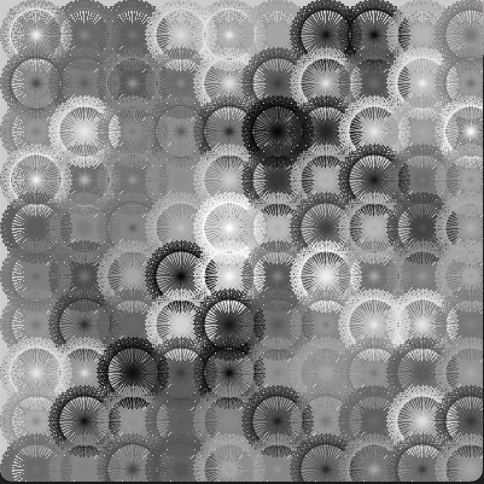

Ombre color 10x10 grid 24 rotations

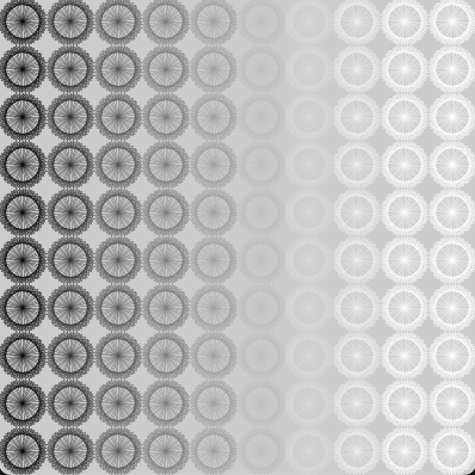

Ombre color 10x10 grid 6 rotations

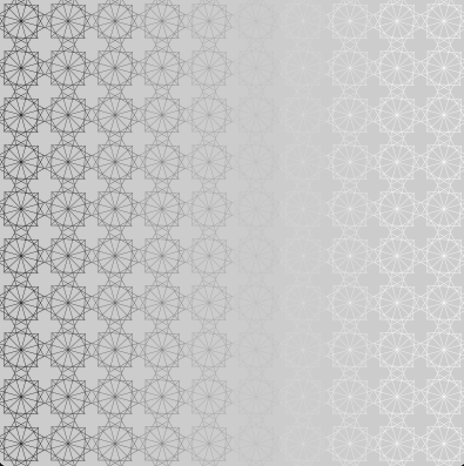

Black Color 20x20 grid 20 rotations

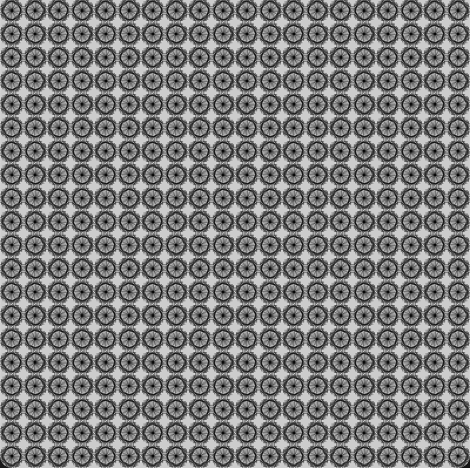

Black Color 20x20 grid 24 rotations with many repetitions

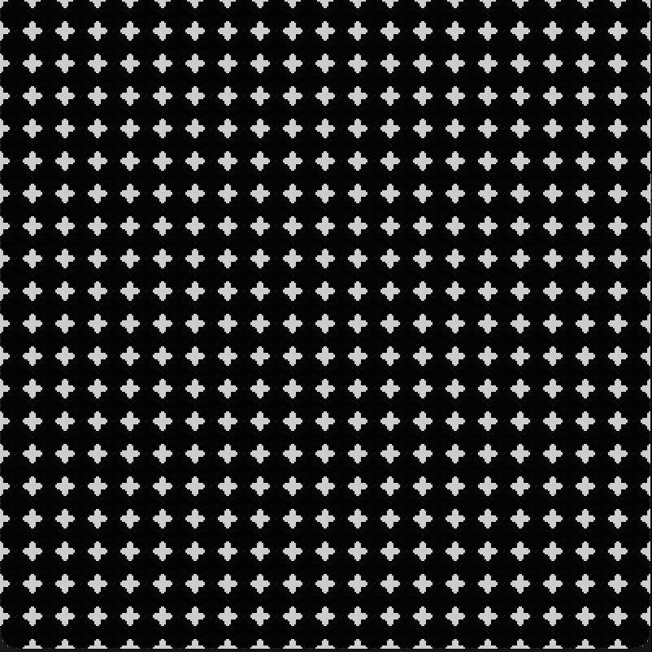


# Extra bugs

I just noticed a bug with multiples of 3 that I fixed by changing 
```python
if i % cellSize == 0:
            for j in range(height):
                
                # Turn on for random everywhere.
                #stroke(r() * 255)
                if j % cellSize == 0:
                    drawObject(i,j)
```

to
```python
if i % cellSize == 0:
            for int(j in range(height)):
                
                # Turn on for random everywhere.
                #stroke(r() * 255)
                if int(j % cellSize) == 0:
                    drawObject(i,j)
```

Changing the if to integers fixed the problem.